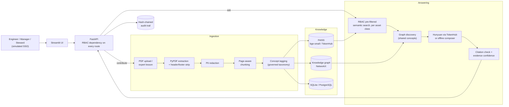

# 🌉 Keppel Knowledge Bridge AI

**Governed cross-asset knowledge intelligence** for the Tencent Cloud *AI CAN DO IT* Hackathon Singapore 2026 (Keppel track).

A data-centre engineer asks *"How can we reduce cooling energy consumption?"* and gets their own data centre's
cooling report **plus** the chiller-plant retrofit proven at an office tower. The answer explains *"Although this
solution originated from an office asset, it is relevant because both involve cooling efficiency and chiller
plants"*, says what to adapt for a 24/7 critical load, cites every file and page, withholds documents the
engineer isn't cleared for, and writes the whole exchange to a tamper-evident audit trail.

It is not a generic chatbot. Four things set it apart:

| Differentiator | How it is built |
|---|---|
| **Cross-asset knowledge transfer** | Retrieval is diversified *per asset class*; each result is labelled same-asset or **Office → Data Centre** with a transfer rationale and adaptation notes |
| **Knowledge-graph relationships** | NetworkX graph of assets, documents, problems, solutions, **shared concepts** and **building systems**. It surfaces precedents that keyword search misses (lift breakdowns → vibration analytics proven on data-centre chillers) |
| **Evidence-backed recommendations** | Every recommendation cites source file + page + asset. Uncited LLM claims are removed. Confidence is computed from evidence, not model self-assessment. It abstains when evidence is missing |
| **Governance** | RBAC enforced *inside* the vector search, PII redaction at ingestion, steward review queue for new knowledge, hash-chained audit log, knowledge-gap tracking |

> ⚠️ All documents in `data/sample_docs` are **synthetic** and watermarked as such. Apart from Keppel Bay Tower
> (used as a recognisable anchor, with a few publicly reported smart-building facts), asset names are fictional
> and every figure is illustrative.

---

## 1. Architecture



**Answer pipeline** (`backend/services/assistant.py`):

1. **Context:** detect which asset class the user is working on (explicit choice → question text → user profile).
2. **Pre-filter:** keep only chunk ids the user may read (approved, permitted classification). FAISS scores only those.
3. **Diversify:** keep the best documents *per asset class*, so office and senior-living evidence isn't crowded out by the user's own asset class.
4. **Graph discovery:** seed concepts from the question, their `skos:related` concepts and the top hits, then pull in linked documents from *other* asset classes.
5. **Generate:** Hunyuan (`hy3` via TokenHub) returns structured JSON recommendations citing `S1..Sn`. Without an LLM, an extractive composer builds the same structure offline.
6. **Verify:** drop recommendations without valid citations and compute confidence = 0.60 × relevance + 0.25 × corroboration + 0.15 × graph alignment.
7. **Audit:** record user, role, question, retrieved and withheld documents, and response to a SHA-256 hash chain.

---

## 2. Folder structure

```
keppel/
├── README.md
├── requirements.txt · .env.example · Makefile · .streamlit/config.toml
├── config/
│   ├── rbac_policy.yaml        # roles → readable classifications + permissions; demo users
│   └── taxonomy.yaml           # cross-asset concept ontology (parent / related / aliases) + building systems
├── backend/
│   ├── main.py                 # FastAPI app: every route goes through the RBAC dependency
│   ├── config.py               # env-driven settings (LLM, embeddings, DB, thresholds)
│   ├── container.py            # wires all services; startup re-index / re-tag / auto-seed
│   ├── db.py                   # SQLAlchemy models: documents, pages, chunks, audit_log, feedback
│   ├── schemas.py              # Pydantic API contract
│   ├── security/rbac.py        # AccessPolicy, Role, User
│   ├── ingestion/              # pdf_loader · pii · chunker · pipeline · seed
│   ├── retrieval/              # embeddings (local/TokenHub/hash) · vector_store (FAISS) · retriever
│   ├── graph/                  # taxonomy tagging · knowledge_graph · export (GraphML / RDF Turtle)
│   ├── llm/                    # OpenAI-compatible client (TokenHub/Hunyuan/Ollama) · prompts
│   ├── services/               # assistant (orchestration) · confidence · audit (hash chain)
│   └── evaluation/evaluator.py # golden-set metrics
├── frontend/
│   ├── app.py                  # Streamlit: Ask · Knowledge graph · Library · Governance · Evaluation · How it works
│   ├── ui.py                   # palette, cards, badges, Graphviz + pyvis renderers
│   └── api_client.py           # HTTP client (the UI never touches the database)
├── data/
│   ├── sample_docs/            # 19 synthetic PDFs + manifest.json (metadata + 2 expert lessons)
│   ├── eval/golden_set.json    # 16 evaluation questions
│   └── store/                  # runtime state (git-ignored): SQLite, FAISS index, uploads, model cache
├── scripts/
│   ├── synthetic_corpus.py     # the corpus content (edit here, then regenerate)
│   ├── generate_dataset.py     # renders PDFs with ReportLab, verifies page counts
│   └── run_eval.py             # CLI evaluation report
└── tests/                      # 24 offline tests (ingestion, RBAC, taxonomy, audit, API flows)
```

---

## 3. Run it locally

Requires Python 3.11+ (tested on 3.12). First start downloads a ~65 MB embedding model and seeds the corpus in a few seconds.

```bash
# 1. install
python3 -m venv .venv
source .venv/bin/activate            # Windows: .venv\Scripts\activate
pip install -r requirements.txt

# 2. (optional) connect Hunyuan - without a key the app runs fully offline
cp .env.example .env                 # then set LLM_API_KEY=<your TokenHub key>

# 3. backend (terminal 1) - seeds the knowledge base on first start
uvicorn backend.main:app --port 8000          # API docs: http://localhost:8000/docs

# 4. frontend (terminal 2)
streamlit run frontend/app.py                 # http://localhost:8501
```

Make shortcuts: `make setup`, `make api`, `make ui`, `make test`, `make eval`, `make data` (regenerate PDFs),
`make reset` (wipe database, index and audit log, but keep the downloaded model).

**Deep links for demos:** `http://localhost:8501/?user=marcus.lee&q=What+was+the+payback+period+of+the+chiller+plant+retrofit`
opens the app as a persona and runs a question. Open an Engineer tab and a Manager tab side by side to show RBAC.

### LLM and embedding providers (all OpenAI-compatible, set in `.env`)

| Setting | Tencent TokenHub (intl, default) | Hunyuan direct (China site) | Local Ollama (offline) |
|---|---|---|---|
| `LLM_BASE_URL` | `https://tokenhub-intl.tencentcloudmaas.com/v1` | `https://api.hunyuan.cloud.tencent.com/v1` | `http://localhost:11434/v1` |
| `LLM_MODEL` | `hy3` or `hy4-preview` | `hunyuan-turbos-latest` | e.g. `qwen2.5:7b` |
| `LLM_PROVIDER` | `auto` (uses API when a key is set) | `auto` | `openai_compatible` (key: `ollama`) |

For TokenHub embeddings, set `EMBEDDING_PROVIDER=openai_compatible` and `EMBEDDING_MODEL=kinfra-text-embedding-0.6b`.
The index rebuilds automatically on the next start, because every index records which embedder built it.
Endpoints and model ids come from Tencent Cloud's TokenHub docs (September 2026). Confirm them against the
hackathon handbook and your console.

---

## 4. The synthetic dataset

21 knowledge items across three asset classes, each with the metadata from the brief
(`asset_type, asset_name, category, problem, solution, impact` and a `classification` that drives access):

| Asset class | Items | Examples |
|---|---|---|
| **Office** (Keppel Bay Tower, Tanjong Quay Tower, Southbank Office Tower) | 6 + 1 expert lesson | chiller-plant AI retrofit, digital twin, setpoint lessons learned, lift predictive maintenance, retrofit business case (Financial), cooling-tower water log |
| **Data Centre** (Tampines DC1, Jurong Hyperscale Campus, Dublin DC2) | 7 | cooling optimisation (PUE 1.68 → 1.52), chiller failure RCA, vibration-analytics pilot, WUE, UPS thermal event, renewable strategy (Strategic), maintenance MOP standard |
| **Senior Living** (Harmony Senior Residences, Sakura Gardens) | 6 + 1 expert lesson | FM quarterly report, lift breakdown log, resident thermal comfort, family survey, power-outage review, utilities investment plan (Financial) |

Classifications: Technical 5 · Maintenance 4 · Operational 9 · Financial 2 · Strategic 1.
The cross-asset stories are built in and checkable. For example, the data-centre cooling report says the team
has **no precedent for chiller-plant optimisation**, and the office retrofit supplies exactly that. Maintenance
logs contain fake phone numbers, e-mails and an NRIC, which are redacted at ingestion.
Edit `scripts/synthetic_corpus.py` and run `make data` to change the corpus.

---

## 5. Requirement → code map (the five build phases)

| Phase | Requirement | Where |
|---|---|---|
| 1 · Basic RAG | PDF upload, extraction, chunking, embeddings, retrieval, answer | `ingestion/*`, `retrieval/embeddings.py`, `retrieval/vector_store.py`, `llm/client.py`, `POST /documents`, `POST /ask` |
| 2 · Metadata filtering | asset-type filter, cross-asset comparison | `retrieval/retriever.py` (per-asset diversification, `asset_filter`, context detection) |
| 3 · Knowledge graph | relationship mapping, similar-solution discovery | `graph/knowledge_graph.py` (`discover`, `similar_documents`, `reasoning_graph`), `GET /graph`, `GET /graph/similar/{id}`, `GET /graph/export` |
| 4 · Enterprise | RBAC, audit logs, confidence scoring | `security/rbac.py`, `services/audit.py`, `services/confidence.py`, `ingestion/pii.py`, review queue (`/review/*`) |
| 5 · Polish | UI, demo scenarios, evaluation dashboard | `frontend/*`, `evaluation/evaluator.py`, `POST /eval/run` |

**Main API routes** (all require the `X-User-Id` header; the interactive docs are at `/docs`):
`POST /ask` · `GET /documents` · `GET /documents/{id}/pages/{n}` · `GET /documents/{id}/file` · `POST /documents` ·
`POST /lessons` · `GET /review/queue` · `POST /review/{id}` · `GET /graph` · `GET /graph/similar/{id}` ·
`GET /graph/export?format=graphml|turtle` · `GET /audit` · `GET /audit/verify` · `GET /governance/summary` ·
`POST /feedback` · `POST /eval/run` · `GET /eval/latest` · `GET /health`.

---

## 6. Evaluation

`make eval` (or the Evaluation page, signed in as Knowledge Steward) runs the 16-question golden set in
`data/eval/golden_set.json`. It covers cross-asset transfer, the same question asked by an Engineer and a Manager,
and out-of-scope questions that must be refused.

Results with local `bge-small` embeddings and the offline composer:

| Metric | Result | Metric | Result |
|---|---|---|---|
| Hit rate | 100% | RBAC leakage | **0** |
| Recall of expected precedents | 100% | Abstention accuracy | 100% |
| MRR | 0.89 | Citation coverage | 100% |
| Cross-asset coverage | 100% | Median retrieval latency | ~10 ms |

**Read these honestly.** The corpus and the questions were both written for this demo, and the retrieval thresholds
were tuned on 10 of the 16 questions. The 6 held-out questions also pass, but that's not proof of production
accuracy. Groundedness is trivially high in offline mode, because the composer quotes its sources. Run
`python -m scripts.run_eval --llm` once a TokenHub key is set to measure the LLM path. Most importantly, grow the
golden set with real questions from Keppel engineers.

With the zero-download `hash` fallback embedder, recall drops to ~0.78, while RBAC leakage stays at 0.
Enforcement doesn't depend on the model.

---

## 7. Demo Day script (≈5 minutes)

1. **Cross-asset transfer:** click *🧊 DC cooling energy* (as Alex, DC engineer). Show the office retrofit card
   ("Office → Data Centre"), its *Why it transfers* and *Adapt for your asset* boxes, the file + page citation,
   and the graph path.
2. **Beyond keywords:** click *🛗 Lift breakdowns* (as Priya, senior living). The graph pulls in data-centre
   vibration analytics through *Equipment Reliability → Predictive Maintenance*, and the question never
   mentions vibration or sensors.
3. **Governance:** click *🔒 Payback · Engineer*, then *💰 Payback · Manager*. The Engineer sees "2 relevant
   documents withheld (Financial)"; the Manager gets the S$1.9M capex and 3.0-year payback.
4. **Capture tacit knowledge:** as Alex, capture an expert lesson. It lands in Sarah's review queue and becomes
   searchable only after approval.
5. **Audit:** as Sarah, open *Governance & audit*, show every question, including denied access attempts, and
   click *Verify hash chain integrity*. For drama, tamper with a row
   (`sqlite3 data/store/kbridge.db "UPDATE audit_log SET question='edited' WHERE id=1"`), verify again to show
   the break, then run `make reset`.
6. **Evidence of quality:** the Evaluation page, with RBAC leakage 0.

---

## 8. Suggestions for the judging criteria

The seven published criteria, with what already covers each and the highest-value next step:

| Criterion | Already in the MVP | Next step (highest value first) |
|---|---|---|
| **Relevance** | literal reading of the brief: capture → reuse → govern across asset classes | Align with the gated **handbook**. If Keppel supplies data, swap it in immediately. Position the tool as the layer that feeds KAI / Alpha and spreads Athena-style data-centre know-how to other assets |
| **Human-centric design** | persona scenarios, transfer rationale, "adapt for your asset", abstention, feedback | An **interview-style capture agent** (the LLM asks follow-up questions to a retiring engineer); a "request access" button on withheld results; a mobile field view for technicians |
| **Use of AI** | Hunyuan structured generation, embeddings, graph reasoning | Turn on `hy3` via TokenHub and TokenHub embeddings; add LLM-suggested concept tags that a steward approves; a hybrid BM25 + reranker; generate a **transfer playbook** (step-by-step pilot plan). Show the required **CodeBuddy / WorkBuddy / Miora** usage, e.g. a WorkBuddy agent that turns `/ask` results into a weekly cross-asset digest |
| **Technical execution** | 24 tests, eval harness, provider abstraction, auto re-index | Deploy to Tencent Cloud (Lighthouse/CVM + TDSQL-C PostgreSQL via `DATABASE_URL`) with a public URL; implement the Tencent VectorDB adapter (mapping documented in `vector_store.py`) |
| **Feasibility** | runs on a laptop, no GPU, configurable providers | A one-slide integration path (SharePoint / CMMS / BMS connectors), cost per query (tokens × TokenHub price), and steward workload estimates |
| **Responsible AI** | RBAC pre-filter, PII redaction, citations, uncited-claim removal, abstention, hash-chained audit, review queue | Add prompt-injection and PII-leak cases to the golden set, a model/data card, a retention policy, and a coverage report of which asset classes are under-documented |
| **Business impact** | quantified precedents in every answer | A **value-of-reuse model**: hours saved per search, avoided re-invention, energy savings if the office retrofit reaches data-centre plants. Benchmark against public claims (JLL: 60% less review labour; CBRE: ~25% less lease processing), labelled as company-reported |

---

## 9. Production path and limitations

- **Identity:** `X-User-Id` simulates SSO. Replace the `current_user` dependency in `backend/main.py` with OIDC/JWT validation (Tencent CAM, Azure AD). Every route already goes through it.
- **Scale:** FAISS `IndexFlatIP` is exact and fine for tens of thousands of chunks; switch to HNSW or Tencent VectorDB beyond that. Run a single API worker, because the index and graph live in process memory.
- **Graph:** exports to GraphML (Neo4j `apoc.import.graphml`) and RDF Turtle (RealEstateCore `rec:Building`, Brick classes, SKOS concepts).
- **Not in the MVP:** OCR for scanned PDFs, multilingual retrieval, document versioning, fine-grained (row-level) permissions per asset.
